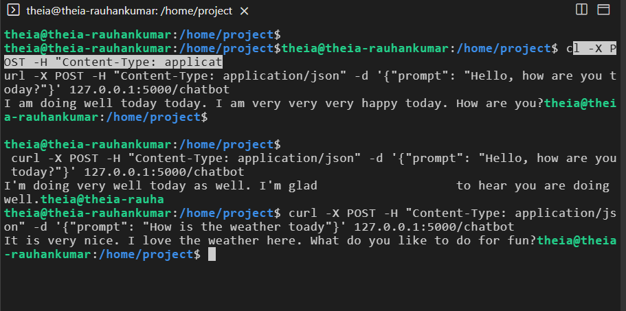

# Lab 2: Simple Chatbot with LLMs

## 🎯 Objective
Build a functional chatbot using **Hugging Face Transformers** (`facebook/blenderbot-400M-distill`).
1.  **Terminal Version**: Chat directly in the command line.
2.  **Web Version**: A simple Flask web interface.

## 🛠️ Prerequisites
```bash
pip install -r requirements.txt
```

## 💻 Implementation

### 1. Terminal Chatbot
Run the script to chat in your terminal.
```bash
python chatbot.py
```

### 2. Web Application (Flask)
Run the web server to chat via a browser.
```bash
python app.py
```
*Open [http://127.0.0.1:5000](http://127.0.0.1:5000) in your browser.*

### 3. Chatbot API
Run the API server to interact via JSON requests (Postman/cURL).
```bash
python app2.py
```
*Endpoint:* `POST http://127.0.0.1:5000/chatbot`
*Body:* `{"prompt": "Hello"}`

## 📸 Results

### Terminal Chat
.png)


### Web Application
**Server Running:**
.png)

**Interface:**


### Chatbot API

