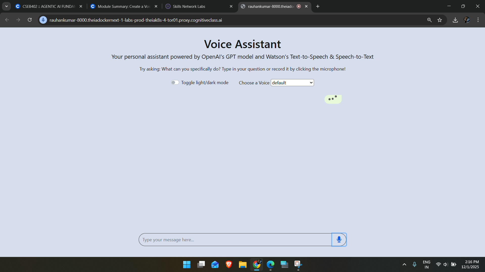

# Lab 3: Voice Assistant with OpenAI & IBM Watson

## 🎯 Objective
Create a voice assistant that:
1.  **Listens**: Converts voice input to text using **IBM Watson Speech-to-Text**.
2.  **Thinks**: Processes the text using **OpenAI GPT-3**.
3.  **Speaks**: Converts the response back to audio using **IBM Watson Text-to-Speech**.

## 🛠️ Prerequisites
```bash
pip install -r requirements.txt
```
*Note: This lab requires access to IBM Watson Lab endpoints and an OpenAI API key.*

## 💻 Implementation

### Backend (`server.py` & `worker.py`)
The Flask server handles two main endpoints:
*   `/speech-to-text`: Receives audio, returns transcribed text.
*   `/process-message`: Receives text, gets GPT response, and returns audio.

### Running the Server
```bash
python server.py
```

## 📸 Results

### Voice Assistant Interface

