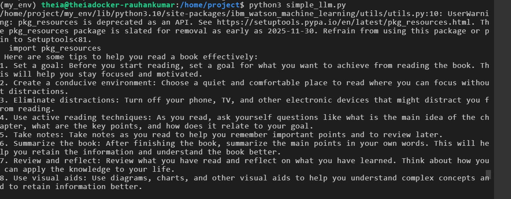

# Lab 4: Business AI Meeting Companion

## 🎯 Objective
Build an AI-powered meeting companion that:
1.  **Transcribes** audio recordings using **OpenAI Whisper**.
2.  **Summarizes** key points using **IBM WatsonX Llama 3**.
3.  **Interacts** via a **Gradio** web interface.

## 🛠️ Prerequisites
```bash
pip install -r requirements.txt
sudo apt install ffmpeg -y
```

## 💻 Implementation


### 1. Simple Transcription (`simple_speech2text.py`)
A script to download a sample audio file and transcribe it.

### 2. Transcription App (`speech2text_app.py`)
A Gradio app that lets you upload audio files for transcription.

### 3. LLM Generation (`simple_llm.py`)
A script to test text generation with Llama 3 on WatsonX.

### 4. Full Meeting Companion (`speech_analyzer.py`)
The final application that combines STT and LLM to transcribe and summarize meetings.

## 📸 Results

### Basic Transcription App


### LLM Generation Test


### Final Speech Analyzer

