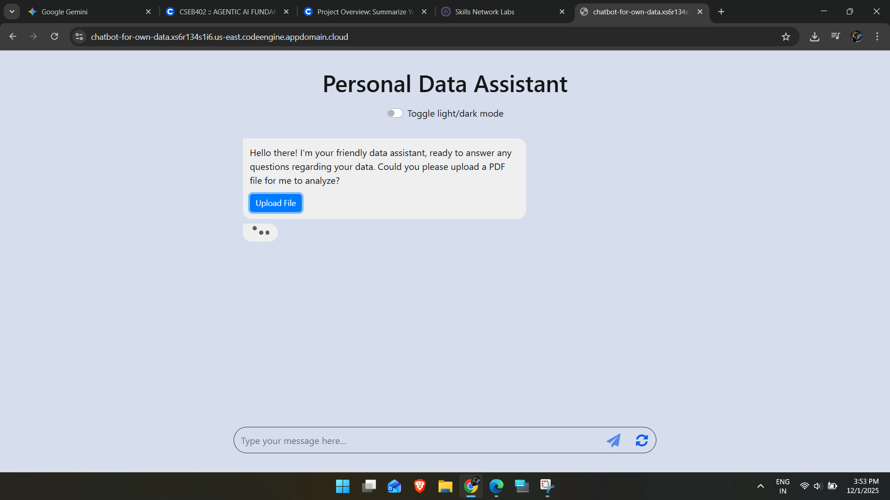

# Lab 5: Chatbot for Your Data

## 🎯 Objective
Build a RAG (Retrieval-Augmented Generation) chatbot that can:
1.  **Ingest** PDF documents.
2.  **Process** them into vector embeddings.
3.  **Answer** questions based on the document content using **WatsonX Llama 3**.

## 🛠️ Prerequisites
```bashw
pip install -r requirements.txt
```

## 💻 Implementation

### 1. Worker (`worker.py`)
Handles the core logic:
*   **LLM**: WatsonX `meta-llama/llama-3-3-70b-instruct`.
*   **Embeddings**: `sentence-transformers/all-MiniLM-L6-v2`.
*   **Vector Store**: `Chroma`.

### 2. Server (`server.py`)
Flask backend to manage file uploads and chat requests.

### 3. Interface
Simple HTML/JS frontend to interact with the bot.

## 🚀 Running the App
```bash
python server.py
```
*Open [http://localhost:8000](http://localhost:8000) in your browser.*

## 📸 Results

### Chat Interface


### Demo Application

