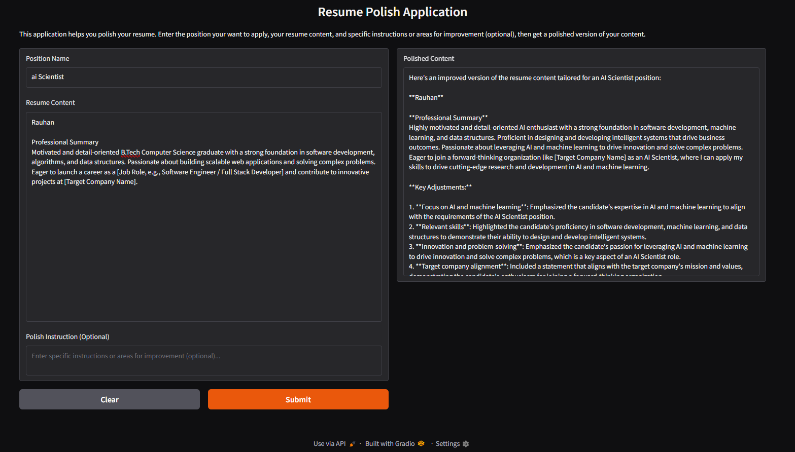
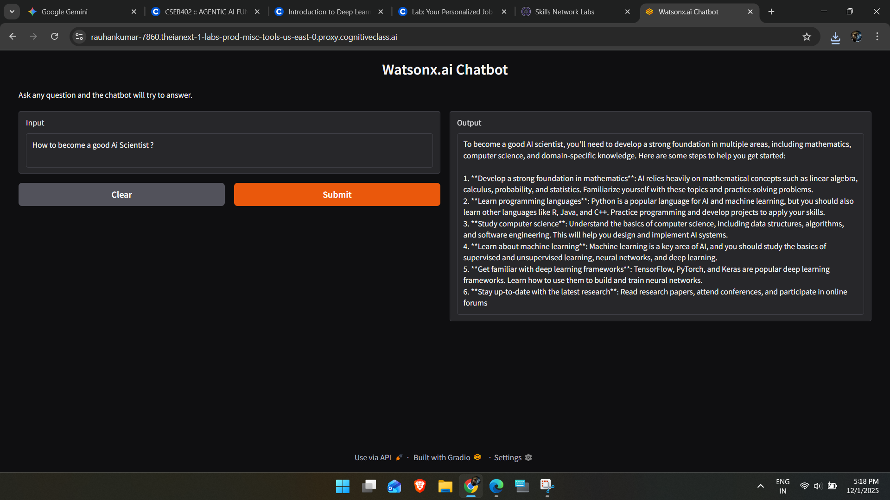
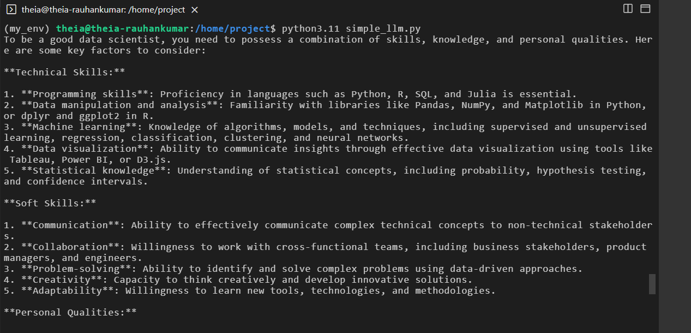

# Lab 7: Personalized Job Application Coach

## 🎯 Objective
Build a suite of AI-powered tools to assist with job applications using **Watsonx Llama 3** and **Gradio**:
1.  **Resume Polisher**: Enhances resume content for specific roles.
2.  **Cover Letter Generator**: Drafts personalized cover letters.
3.  **Career Advisor**: Provides strategic advice based on resume and job description.

## 🛠️ Prerequisites
```bash
pip install -r requirements.txt
```

## 💻 Implementation

### 1. Resume Polisher (`resume_polisher.py`)
Takes a position, resume content, and optional instructions to polish the resume.

### 2. Cover Letter Generator (`cover_letter.py`)
Takes company name, position, job description, and resume to generate a cover letter.

### 3. Career Advisor (`career_advisor.py`)
Analyzes resume against a job description to offer improvement advice.

## 📸 Results

### Resume Polisher


### Cover Letter Generator


### Career Advisor


### Watsonx Chatbot


### Simple Terminal Response

